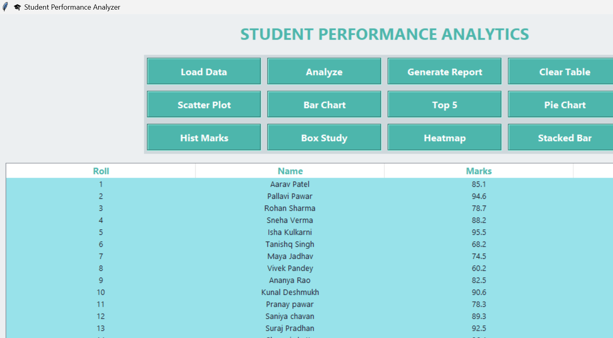

# 📊 Student Performance Analyzer

A Python-based project that analyzes student academic data to identify patterns, measure performance, and generate meaningful insights using data visualizations.

---

## 🚀 Project Overview

This project:
- Analyzes student performance data from an Excel/CSV file  
- Studies the relationship between study hours and marks  
- Generates visual graphs for better understanding  
- Helps identify high performers, low performers, and overall trends  

---

## 🎯 Purpose of the Project

- To analyze student data efficiently  
- To help understand academic strengths and weaknesses  
- To support teachers, parents, and students in decision-making  

---

## 🌟 Features

- Data cleaning and preprocessing  
- Calculation of performance metrics  
- Study-hours vs marks correlation  
- Visualizations using:  
  - Line graphs  
  - Bar charts  
  - Scatter plots  
- Insights and summary reports  

---

## 📁 Dataset Information

Your dataset typically contains:
- Student Name  
- Study Hours  
- Marks  
- Subject(s)  
- Attendance (optional)  
- Any additional performance indicators  

---

## 🛠️ Technologies Used

- Python  
- Pandas  
- Matplotlib  
- Seaborn  
- NumPy  

---

